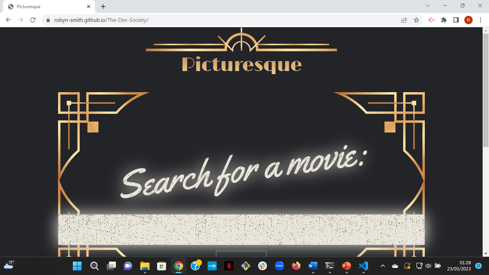
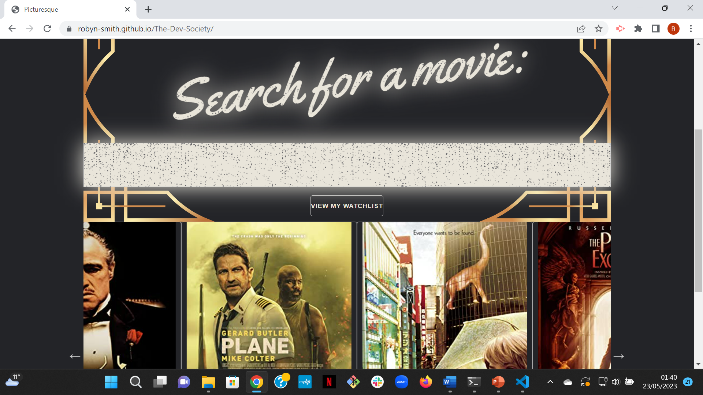
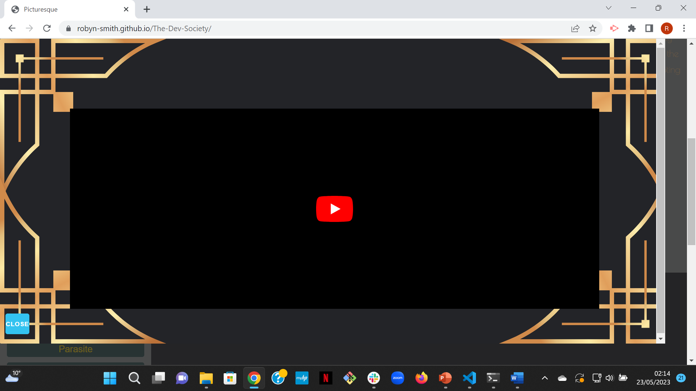
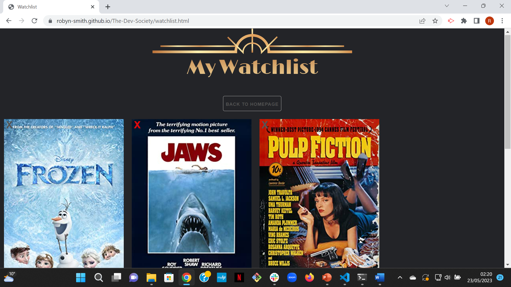
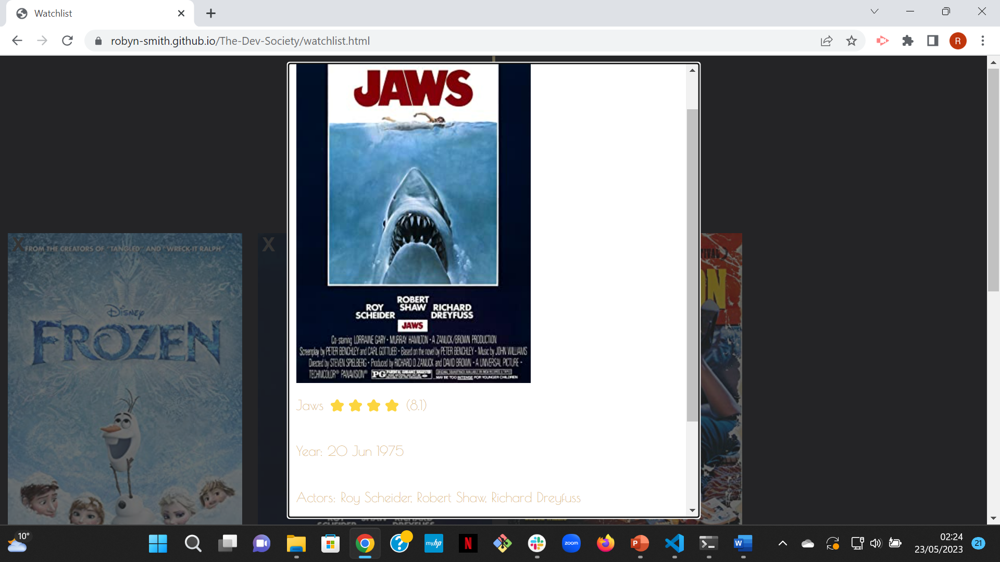

# The-Dev-Society
```
**User Story**
As a user I want to be able to search for my favourite films and films I haven’t seen yet to find out more information about them and add them to my watch list. So that I can store my watch list and remember which films I would like to watch next. 

**Acceptance Criteria**
When I search for a film
Then I am provided with an image of the film poster, the trailer, name, rating, location, cast and plot of the film
When I press a button
Then the film saves to my watch list
When I view my watchlist 
Then I am presented with the names of all the films I have saved
When I have watched a film 
Then I am able to tick off (checklist)/ remove this from my watch list
When I look at the website from multiple devices
Then I am presented with a responsive website that looks good on all devices
```
## Description
## Welcome page
This website uses a combination of HTML, CSS and JavaScript code to create a fun and exciting experience for the user. When the user opens the welcome page, they are presented with the name of the webpage 'Picturesque', this is a large heading element with golden art deco styling and border surrounding. The name Picturesque was chosen as the word fit well with the film aspect and fit well with our choice in branding. The golden art deco styling and black background was used throughout the website as a branding choice as it looked elegant and matched the 1920 cinema golden cinema style. Another eye-catching element for the user is the glowing light up search bar and “search for a movie” heading. This was created using google font “yellow tail”, drop shadows and a background image in CSS. The grainy white image used was to represent the static screen on old TVs; which works well with the branding of the site. The user can search for a film by typing into the search bar and pressing enter; this adds interactivity to the site. When typing autofill dropdown options will appear to make this process quicker for the user, improving on the user experience. At the bottom of the welcome page, there is a slick carousel that loops through a number of film posters. This was created so that the user can also select a film instead of searching for a specific name. This was created using a jQuery ui and is not only helpful for the user but also looks dynamic and adds movement to the page. The welcome page also has a button that directs the user to their own watchlist page.





## Main page
Once a user has either searched for a film or selected a poster from the slick; they are then presented with the main page. The main page is composed of an aside, main, sections, div html elements have been added dynamically via the JavaScript code. The main element has a heading element at the top with the movie title and star emojis with the OMBD film rating. The amount of emojis that appear depend on the OMBD rating of the film, the star rating has a total of 5 and has been worked out using JavaScript. The main is divided into two sections, the first containing the poster and the section containing the information about the film; both of which have been gathered from the OMBD API. The skeleton CSS framework was used to make adding responsivity of this page; so that it can be used on different sized devices making it more accessible. Media queries and display flex attributes were also added to the CSS to support a responsive design. When the user clicks on the poster a large modal appears on the screen, this houses the trailer video retrieved from the YouTube API. This is also styled with the art deco black and gold branding. There is a close button available to close the modal. Additionally, at the bottom of the film information section is a map showing where the film was created. This uses a few different APIs, the OMBD API was used to discover the films creation, the GeoCode and Google map APIs were used to create the map and locate the country. 
Furthermore, the aside consists of the search bar, search history, buttons including the search, return to homepage, and view my watch list button. The user can use this to search for another film. Each button and poster button has CSS hover attributes to inform where they are clicking; which better improves the user experience and avoids confusion. They may also want to click on a film they have recently searched for, this is saved and available to select with the use of local storage. Additionally, local storage was also used in the creation of the watch list, the user can add films to their watch list by selecting the add to watch list button in the middle of the film information section. After this has been selected once a message will be displayed telling the user that the film has been added to the watch list. Following this click event the button will change from “add to watchlist” to “remove from watch list; if then clicked again it removes the film from the watchlist and displays this as a message. The user also has the option to return to the previous page or to view their watchlist by selecting the according button in the aside.




## Watchlist
Similarly, the watchlist continues with the art deco styling in the header to follow the branding of the webpage. A large heading element was used to clearly tell the readers that they are on their watch list page. The user will see the posters of the films that they have previously added to their watchlist. This functionality was created using JavaScript and local storage and allows the website to retain client storage. After the user clicks on the poster of a film, they will see a modal appear with a short summary of some of the film information again including the film title, rating, year of release, actors and plot. The user also has the ability to remove films from their watchlist by clicking the cross button on the top left-hand side of each individual poster. Using CSS code, the cross turns red in colour when hovered over so that the user knows where they are clicking. Correspondingly, the poster also fades in colour when hovered over for the same reason.





## Usage
This application is very interactive, clear and easy for users to navigate. The user has the ability to enter the name of a film in the search bar. As the user types they will notice an auto fill option, they have the option use this and save time in typing a film to search. A user can use autofill by selecting an option from the drop-down list that appears when typing. Once the user has finished typing, they can search for the film by pressing enter on the keyboard, once clicked the page will display the film poster, title, rating, actors, plot, genre, year of release and the name of the country where the film was created along with a map displaying the location. Should the user click the poster; they are then presented with a modal displaying the trailer of that film, they can then click play and watch the film. The user can close the model by selecting the close button below. The user may also notice to the left of the screen that their recent searches have been added. The user also has the ability to click their recently searched films. If the user selects a film from the search history, they are redirected to the same information page with the according film’s poster, title, rating, actors, plot, genre, year of release, country and map. 
Additionally, an “add to watchlist” button is provided for every film underneath the film information. If a user selects this button, they will see a message below telling them that either the film has been added to their watchlist. Once added the text on the button changes to “remove from watchlist” If this button is selected, it will tell the user it has been removed from the watchlist. When a user clicks the button view my watchlist, on the left side of the screen, they will be directed to the my watchlist page. Once the user has selected this, they will see all of the posters of films they have chosen. If the user selects the image poster, they will see a modal containing a brief overview of the film plot, title, rating and cast/actors. If the user wishes the close the modal, they can click anywhere on the page outside of the modal. If a user wishes to remove particular films from their watch list, they can select the red cross button in the top left corner. To leave the my watchlist page the user can select the “back to homepage” button at the top of the page. The user may also notice the selection of film posters rotating/scrolling at the bottom of the page. This allows the user to select a film through clicking on the poster rather than typing or having to think of a specific film on their own. If the user clicks one of these posters, they are directed to the information page about that film. If a user wishes to return to the homepage, they can select the “back to main” button.

## Technologies Used
This application is built using the following technologies:
- **HTML5**: Markup language for structuring content.
- **CSS**: Stylesheet language for styling HTML content.
- **JavaScript**: Programming language for adding interactivity and dynamic content.

## APIs Used
This application is built using the following APIs:
- **GeoCode**: for City/Country to Latitude/Longitude
- **OMDB**: for Movie details
- **YouTube**: for Movie Trailer from YouTube
- **Google Map**: for showing Country in Google Map

## Credits
 - https://jsfiddle.net/RenaissanceDesign/r8p05kg4/ - for the art deco border that has been adapted.
 - http://kenwheeler.github.io/slick/ -the slick jQuery UI

## Link to Picturesque
 Link to the deployed webpage on GitHub Pages:
 https://robyn-smith.github.io/The-Dev-Society/
